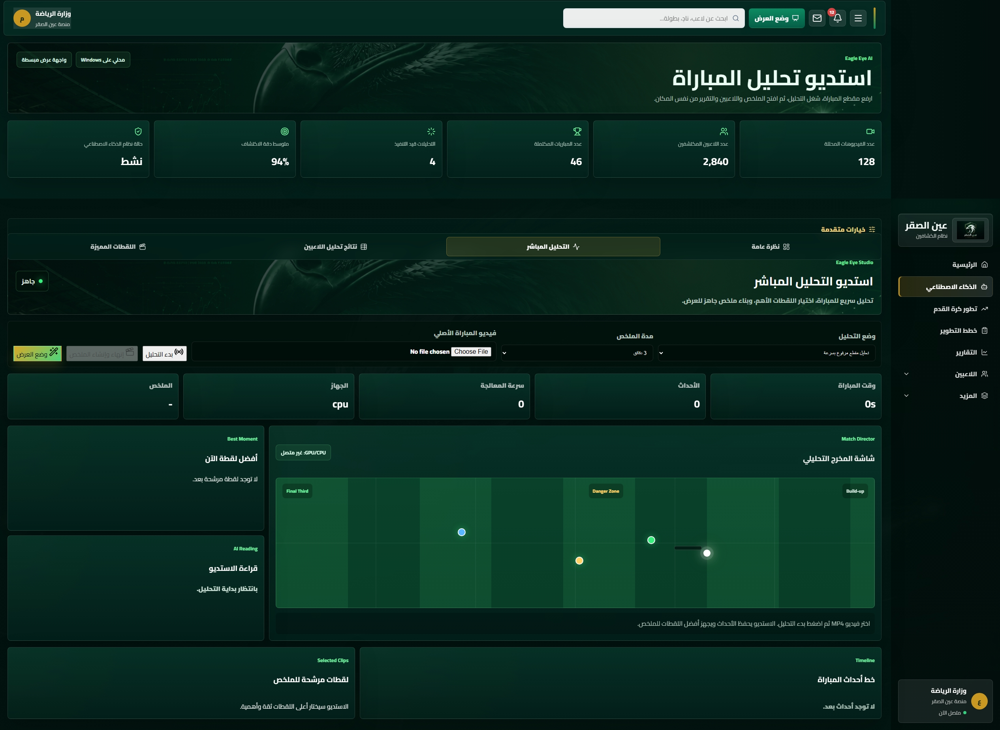
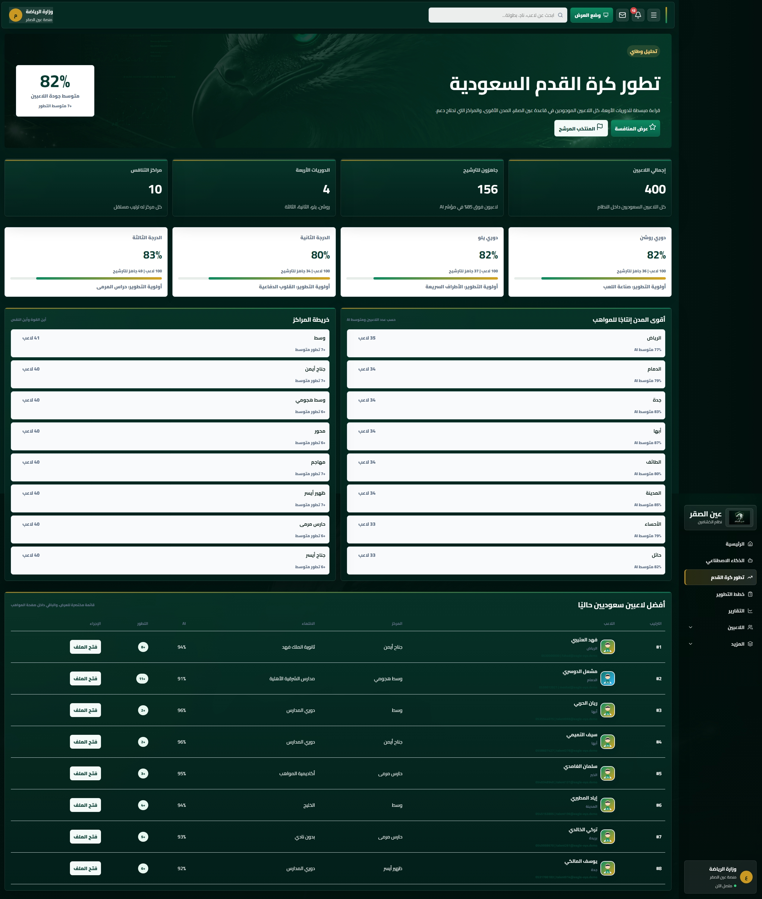
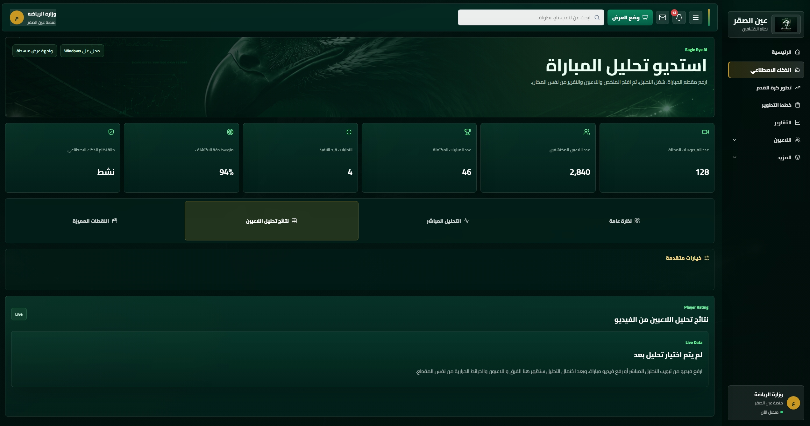
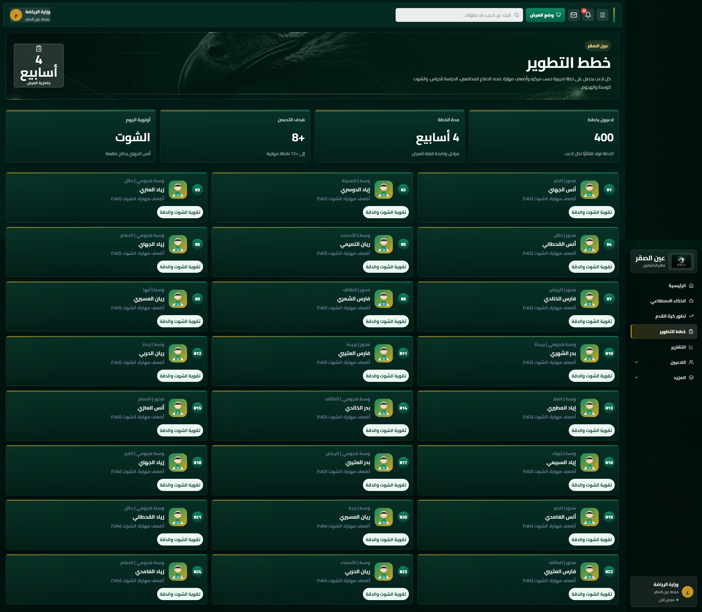
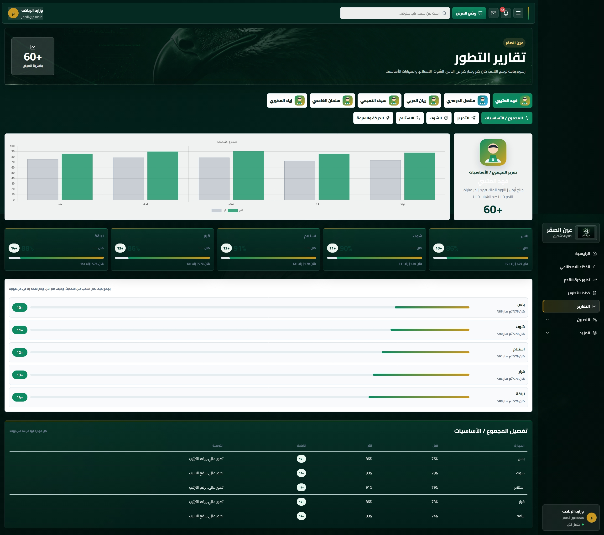
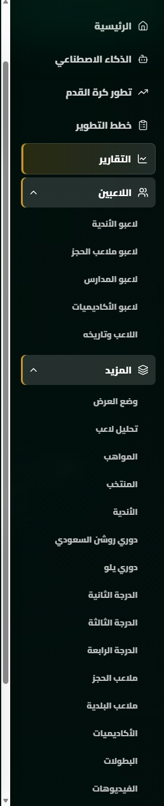

# 🦅 Eagle Eye | عين الصقر

### AI-Powered Football Scouting & Talent Development System

**Eagle Eye (عين الصقر)** is an independent football technology project that explores how artificial intelligence, computer vision, data analytics, and software systems can support football scouting, player evaluation, talent discovery, and long-term player development.

> 🚧 **Project Status: Under Active Development**

This project was created and developed as a **personal initiative** through self-learning, research, experimentation, and continuous development.

I am currently a university student studying **Information Technology with a focus on Cybersecurity**, and I developed this project without professional industry experience. Eagle Eye represents my attempt to turn an ambitious idea into a functional technical prototype while continuously developing my skills.

---

# 🖥️ Project Preview

## 🏠 Main Platform

The main interface brings together the core Eagle Eye features, including match analysis, player scouting, talent discovery, reports, and player development tools.

---

## 🤖 AI Match Analysis Studio

A dedicated workspace designed to process football match footage and transform video into structured information that can support player and match analysis.

---

## ⚡ Live Match Analysis

The live analysis concept is designed to visualize match activity, player positioning, important events, selected moments, and analysis progress.

---

## 📈 Football Development Analytics

A strategic dashboard concept for viewing player development indicators, regional talent distribution, development priorities, and promising players.

---

## 🎯 Player Development Plans

The platform includes individual player development concepts covering areas such as shooting, passing, physical performance, defensive ability, and other position-specific requirements.

---

## 📊 Performance & Scouting Reports

Eagle Eye is designed to convert player and match information into understandable reports that can assist with evaluation, scouting, and development decisions.

---

## 🔐 Platform Access

A dedicated authentication interface provides controlled access to the management platform.

---

# 🎯 Overview

Traditional football scouting depends heavily on manual observation, limited match coverage, and individual judgement.

Eagle Eye explores a different approach.

The goal is to create a centralized platform capable of collecting and organizing football data from different environments and using technology to help identify promising players who may otherwise receive limited exposure.

The platform concept covers players from environments such as:

- Professional clubs
- Football academies
- Schools
- Private football fields
- Youth competitions
- Lower football divisions
- Local tournaments

The long-term idea is to create a structured pathway from **match footage → analysis → player evaluation → talent identification → development plan → continuous monitoring**.

---

# 💡 The Idea

A talented player can exist anywhere.

They may be playing for a professional academy, a school team, a small local club, or simply on a private football field.

The problem is that scouting resources cannot be everywhere at the same time.

Eagle Eye explores whether technology can help increase scouting coverage by analyzing match footage and organizing player performance information into a centralized system.

Instead of replacing scouts and coaches, the goal is to provide them with another tool for discovering, comparing, and following players.

---

# 👁️ The Vision

The long-term vision for Eagle Eye is to build an intelligent football scouting ecosystem capable of supporting the complete player-development journey.

### Discover

Identify promising players from different football environments.

### Analyze

Evaluate player actions and performance using match footage and structured data.

### Compare

Compare players based on position, age group, performance indicators, and development potential.

### Develop

Identify weaknesses and create targeted development priorities.

### Monitor

Track the player's progress across multiple matches and stages.

### Report

Transform complex performance information into clear scouting and development reports.

---

# ⚙️ How the System Works

The proposed Eagle Eye workflow follows several stages:

### 1. Match Footage

A football match or selected video is provided to the system.

### 2. Player & Ball Detection

Computer vision models identify players and the football inside video frames.

### 3. Tracking

Detected objects are tracked across consecutive frames.

### 4. Team Identification

Players can be grouped according to their respective teams.

### 5. Event Detection

The system concept aims to recognize football actions such as:

- Passes
- Shots
- Dribbles
- Defensive actions
- Goalkeeper actions
- Ball recoveries
- Key attacking moments

### 6. Performance Analysis

Detected actions are converted into structured performance information.

### 7. Player Evaluation

The collected information contributes to an overall player-performance profile.

### 8. Talent Discovery

Promising players can be highlighted for further human evaluation.

### 9. Development Planning

Performance weaknesses can be converted into development priorities.

### 10. Continuous Monitoring

Future matches can be used to monitor player improvement over time.

---

# 🧠 AI & Computer Vision

Artificial intelligence is one of the core areas being explored within Eagle Eye.

The computer-vision pipeline is designed around concepts including:

- Player detection
- Ball detection
- Object tracking
- Team classification
- Player identification
- Event recognition
- Movement analysis
- Match segmentation
- Highlight extraction
- Performance aggregation

The AI component is **still under development**, and the current project should be considered a prototype rather than a production-ready AI system.

---

# 📊 Player Performance Analysis

The platform concept supports analysis across several football dimensions.

### ⚽ Attacking

- Goals
- Shots
- Shots on target
- Assists
- Key passes
- Chances created
- Dribbles
- Offensive involvement

### 🎯 Passing

- Completed passes
- Attempted passes
- Pass accuracy
- Progressive passes
- Forward passes
- Long passes
- Through balls

### 🛡️ Defensive

- Tackles
- Interceptions
- Recoveries
- Clearances
- Blocks
- Defensive duels

### 🏃 Physical & Movement

- Distance covered
- Movement patterns
- Positioning
- Work rate
- Sprint activity
- Player heatmaps

### 🧤 Goalkeepers

- Saves
- Goals conceded
- Distribution
- Claims
- Defensive actions

---

# 👤 Player Profiles

Each player can have a centralized profile containing information such as:

- Name
- Age
- Nationality
- Position
- Preferred foot
- Current team or environment
- Match history
- Performance history
- Development priorities
- Player rating
- AI-generated insights
- Selected highlights

The purpose is to create a long-term football record rather than evaluating a player from a single match.

---

# 🔎 Talent Discovery

One of the primary goals of Eagle Eye is talent discovery.

The platform is designed to help identify promising players based on performance information rather than reputation alone.

Potential scouting filters can include:

- Position
- Age
- Region
- Competition
- Performance
- Development potential
- Playing environment

This could allow scouts to narrow large groups of players into smaller groups requiring detailed human evaluation.

---

# 📈 Player Development

Finding talent is only the first stage.

Eagle Eye also explores how performance data can help determine what a player should improve next.

A development plan could focus on areas such as:

- Shooting
- Passing
- Decision-making
- Defensive positioning
- Physical development
- Movement
- Technical ability

Progress could then be compared across future matches.

---

# 🗺️ Platform Coverage

The Eagle Eye concept is designed to support talent discovery across multiple football environments.

These include:

- Professional clubs
- Youth teams
- Academies
- Schools
- Private football fields
- Local competitions
- Lower divisions
- Community tournaments

The broader goal is to reduce the possibility of talented players being overlooked simply because they are outside traditional scouting networks.

---

# 📑 Reports

The reporting system is designed to present complex football information in a clear format.

Potential reports include:

- Individual player reports
- Match performance reports
- Development reports
- Scouting reports
- Player comparisons
- Talent rankings
- Regional development insights

Reports are intended to support human decision-making rather than automatically make final sporting decisions.

---

# 🏗️ Current Project Status

**Eagle Eye is currently under active development.**

The project is not presented as a finished commercial product.

The current version includes a working interface prototype and multiple system concepts, while several areas remain experimental or under development.

### Current work includes:

- Platform interface design
- Database architecture
- Player-management concepts
- Match-analysis workflows
- Scouting dashboards
- Development-plan systems
- Reporting interfaces
- AI experimentation
- Computer-vision experimentation
- Video-analysis workflows

Some features displayed in the interface currently use **demonstration data** to visualize how the complete system could operate.

---

# 👨‍💻 About the Developer

Hi, I'm **Fahad**.

I have a background in **Programming and Databases**, and I am currently studying for a Bachelor's degree in **Information Technology with a focus on Cybersecurity**.

I do not currently have professional industry experience.

Eagle Eye was started as a personal idea and developed through my own learning, research, experimentation, and curiosity about how technology could be applied to football.

Building this project has pushed me to learn beyond the classroom and explore different areas including software development, databases, system design, artificial intelligence, computer vision, and data analysis.

I am still learning, and Eagle Eye is still evolving.

My goal is to continue improving the platform as my technical knowledge and experience grow.

---

# 🛠️ Areas Explored Through This Project

Working on Eagle Eye has allowed me to explore and develop skills related to:

- Software development
- Database design
- System architecture
- UI/UX concepts
- Data modeling
- Artificial intelligence
- Computer vision
- Video processing
- Football analytics
- Requirements analysis
- Problem solving
- Technical research

---

# 🚀 Future Development

Planned and experimental areas for future versions include:

- Improved player detection
- Improved ball tracking
- More reliable player tracking
- Automated event recognition
- Player re-identification
- Team classification
- Advanced player heatmaps
- Automated highlight generation
- Improved performance-rating models
- Player comparison tools
- Scouting recommendation systems
- Development-progress tracking
- More advanced analytics
- Expanded database architecture
- Improved reporting
- Performance optimization
- Real-world testing

The roadmap will continue to evolve as the project develops.

---

# 🔒 Source Code & Intellectual Property

This repository is primarily intended to **showcase the Eagle Eye project and its development progress**.

The complete source code, internal implementation, AI pipeline, algorithms, system logic, and other proprietary components are **not publicly provided in this repository**.

The screenshots and documentation are provided to demonstrate the project's concept, design, architecture, and development direction.

---

# ⚠️ Prototype & Affiliation Disclaimer

Eagle Eye is an **independent personal prototype**.

It is **not affiliated with, endorsed by, sponsored by, commissioned by, or officially deployed by the Saudi Ministry of Sport or any other government organization, football federation, club, academy, or commercial entity** unless explicitly stated otherwise in the future.

Government names, organization names, player information, statistics, performance values, match information, and other data visible within prototype screenshots may be **fictional or demonstration data** created solely to illustrate the system concept.

AI-generated results and performance indicators shown within the prototype should not be interpreted as validated production results.

---

# 🤝 Open to Opportunities

I am interested in opportunities where I can continue learning and developing my skills in areas such as:

**Software Development • Databases • Cybersecurity • Artificial Intelligence • Data Analysis • Sports Technology**

I am also interested in connecting with developers, researchers, football technology professionals, and others interested in the intersection between **technology, data, AI, and football**.

---

### 🦅 Eagle Eye | عين الصقر

**Discover. Analyze. Develop.**

*An independent project built from an idea, continuous learning, and the ambition to turn technology into something useful.*
